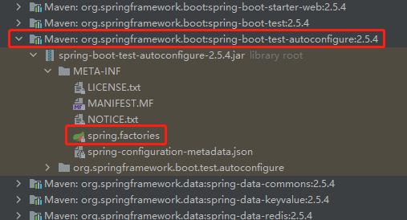
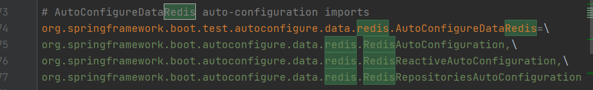
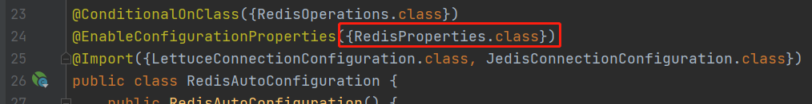
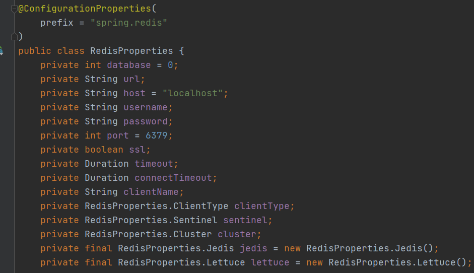
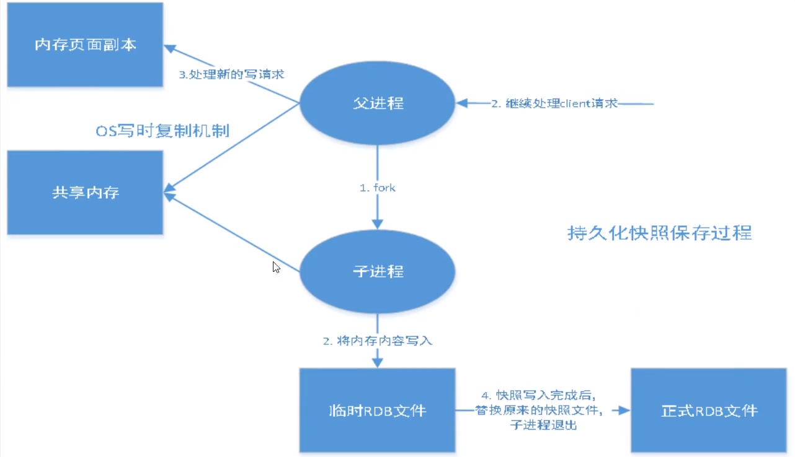
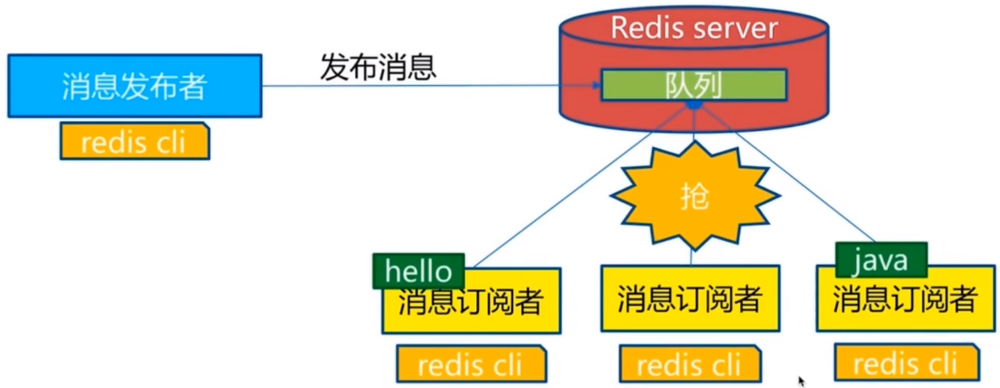
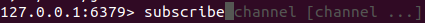
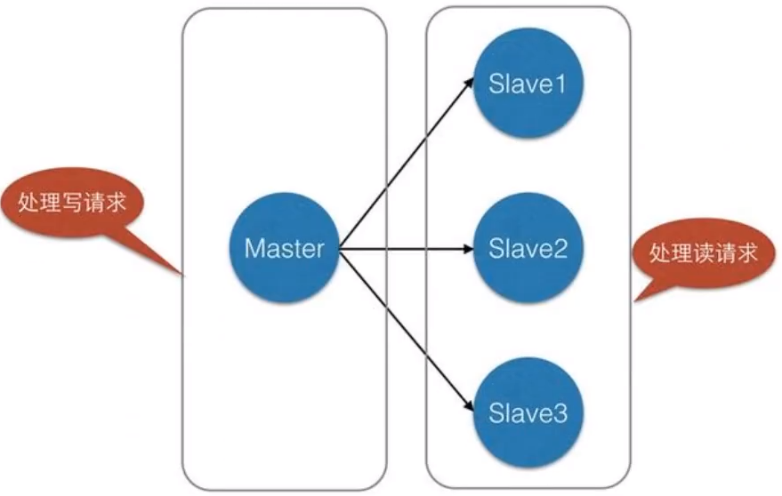
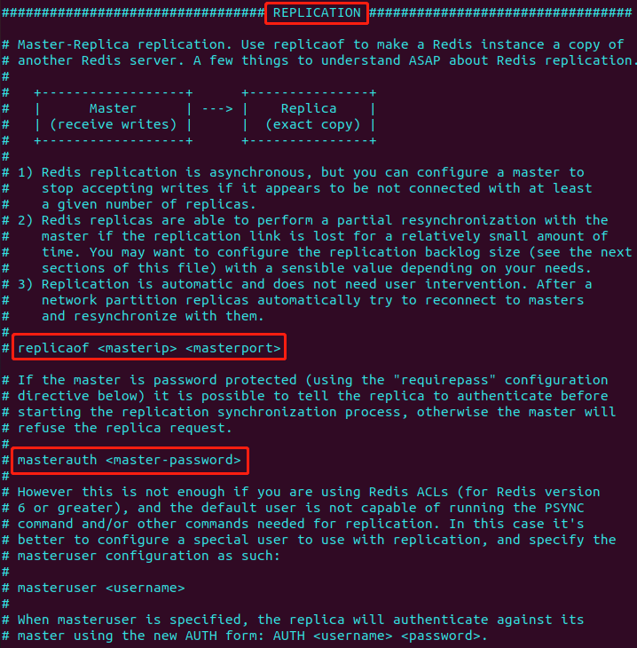

# Redis
 
## 1 概述

+ what

ReDiS = Remote Dictionary Server

kv nosql数据库 结构化数据库

由 C 语言编写，多种语言接口


+ 作用

1. 内存存储、持久化，内存中是断电即失
2. 效率高，可用于高速缓存
3. 发布订阅系统
4. 地图信息分析
5. 计时器、计数器
6. ... ...


+ 特性

1. 多样的数据类型
2. 持久化
3. 集群
4. 事务
5. ... ...


+ 安装 redis

最新版 redis 6.2.5 {22:14:06 星期六 2021年8月28日}

```bash
wget https://download.redis.io/releases/redis-6.2.5.tar.gz
tar zxvf 6.2.5.tar.gz
sudo apt-get install gcc # 基本的 cpp 环境得安装
make
make install
```

设置允许后台启动
```bash
# By default Redis does not run as a daemon. Use 'yes' if you need it.
# Note that Redis will write a pid file in /var/run/redis.pid when daemonized.
# When Redis is supervised by upstart or systemd, this parameter has no impact.
daemonize yes
```

用该配置后台启动
```bash
jia@jia-virtual-machine:~$ redis-server config/redis.conf 
```

打开客户端
```bash
jia@jia-virtual-machine:~$ redis-cli -p 6379
```

查看 redis 服务
```bash
jia@jia-virtual-machine:~$ ps -ef|grep redis
jia        17873     891  0 22:23 ?        00:00:00 redis-server 127.0.0.1:6379
jia        17950    5908  0 22:31 pts/0    00:00:00 grep --color=auto redis
```

关闭
```bash
jia@jia-virtual-machine:~$ redis-cli -p 6379
127.0.0.1:6379> SHUTDOWN 
not connected> exit
jia@jia-virtual-machine:~$ ps -ef|grep redis
jia        17962    5908  0 22:32 pts/0    00:00:00 grep --color=auto redis
```

+ redis-benchmark

压力测试工具
```bash
jia@jia-virtual-machine:~$ redis-benchmark -h localhost -p 6379 -c 100 -n 100000
```

测试结果
```bash
# 前边各种命令一顿测试，最后给出总结

Summary:
  throughput summary: 55710.31 requests per second
  latency summary (msec):
          avg       min       p50       p95       p99       max
        1.061     0.216     1.039     1.695     1.935     4.479
```

+ 基础知识

redis 默认有 16 个数据库，默认使用第 1 个

+ 一些操作

```bash
127.0.0.1:6379> select 3 # 选择数据库
OK
127.0.0.1:6379[3]> select 0 # 选择了 3 号数据库
OK
127.0.0.1:6379> set 1 2
OK
127.0.0.1:6379> get 1
"2"
127.0.0.1:6379> dbsize 
(integer) 1
127.0.0.1:6379> keys *
1) "1"
127.0.0.1:6379> flushdb # 清空当前数据库
OK
127.0.0.1:6379> dbsize
(integer) 0
127.0.0.1:6379[3]> flushall # 清空全部数据库
OK
```

+ redis 是单线程的

redis 是很快的，基于内存操作的，cpu 不是性能瓶颈，redis 的瓶颈是机器内存和网络带宽

## 2 数据类型

### 2.1 Redis-Key
```bash
127.0.0.1:6379> set name weiyupeng
OK
127.0.0.1:6379> get name
"weiyupeng"
127.0.0.1:6379> exists name
(integer) 1
127.0.0.1:6379> exists name name2 # 实际上的返回存在的个数
(integer) 1
127.0.0.1:6379> set name2 123
OK
127.0.0.1:6379> expire name2 10 # 存活时间 单位是秒
(integer) 1
127.0.0.1:6379> ttl name2 # 查看 key 的剩余时间
(integer) 6
127.0.0.1:6379> ttl name2
(integer) 4
127.0.0.1:6379> ttl name2
(integer) 0
127.0.0.1:6379> exists name2
(integer) 0
127.0.0.1:6379> get name2
(nil)
127.0.0.1:6379> type name
string
```

### 2.2 String

```bash
127.0.0.1:6379> append name ,hello
(integer) 15 # 返回字符串长度
127.0.0.1:6379> append name2 zhangsan # 对于不存在的 key，append 相当于 set
(integer) 8
127.0.0.1:6379> del name2
(integer) 1
127.0.0.1:6379> get name
"weiyupeng,hello"

127.0.0.1:6379> substr name 2 5 # 取子串 两边都是闭区间
"iyup"
127.0.0.1:6379> substr name 5 -5 # 负数表示从后往前数
"peng,h"
127.0.0.1:6379> substr name -1 2
""
127.0.0.1:6379> substr name 6 18
"eng,hello"
127.0.0.1:6379> substr name 18 25
""

127.0.0.1:6379> set age 18
OK
127.0.0.1:6379> incr age # ++
(integer) 19
127.0.0.1:6379> decr age # --
(integer) 18
127.0.0.1:6379> incrby age 10
(integer) 28
127.0.0.1:6379> decrby age 10
(integer) 18
127.0.0.1:6379> decrby age -10
(integer) 28
127.0.0.1:6379> incrby age -10
(integer) 18

127.0.0.1:6379> set key weiyupeng
OK
127.0.0.1:6379> getrange key 0 3
"weiy"
127.0.0.1:6379> getrange key 0 -1
"weiyupeng"
127.0.0.1:6379> setrange key 0 W
(integer) 9
127.0.0.1:6379> get key
"Weiyupeng"
127.0.0.1:6379> setrange key 0 WEI # 从 index 0 开始替换
(integer) 9
127.0.0.1:6379> get key
"WEIyupeng"

# setex (set with expire) # 设置过期时间
# setnx (set if not exists) # 不存在才设置
127.0.0.1:6379> setex key2 20 ming
OK
127.0.0.1:6379> setnx key3 redis
(integer) 1
127.0.0.1:6379> setnx key3 redis
(integer) 0

127.0.0.1:6379> mset k1 v1 k2 v2 k3 v3
OK
127.0.0.1:6379> mget k1 k2 k3
1) "v1"
2) "v2"
3) "v3"
127.0.0.1:6379> msetnx k1 v1 k4 v4 k5 v5
(integer) 0 # 说明是原子操作 k1 插不进去后边也插不进去

# 存对象
127.0.0.1:6379> set user:1 {name:weiyupeng,age:25}
OK
127.0.0.1:6379> get user:1
"{name:weiyupeng,age:25}"
127.0.0.1:6379> mset user:1:name weiyupeng user:1:age 25
OK
127.0.0.1:6379> mget user:1:name user:1:age
1) "weiyupeng"
2) "25"

127.0.0.1:6379> getset db redis
(nil)
127.0.0.1:6379> getset db memcache # 先 get 再 set
"redis"
127.0.0.1:6379> getset db redis
"memcache"
```

### 2.3 List

列表，可以当成 stack 和 queue 使用

```bash
127.0.0.1:6379> lpush list 1
(integer) 1
127.0.0.1:6379> lpush list 2 3
(integer) 3
127.0.0.1:6379> get list
(error) WRONGTYPE Operation against a key holding the wrong kind of value
127.0.0.1:6379> lrange list 0 -1 # 结果是反的 因为 lpsuh = left push
1) "3"
2) "2"
3) "1"
127.0.0.1:6379> rpush list 1 2 3
(integer) 3
127.0.0.1:6379> lrange list 0 -1
1) "1"
2) "2"
3) "3"
127.0.0.1:6379> lrange list 5 -8
(empty array)

127.0.0.1:6379> lpop list 1
1) "1"
127.0.0.1:6379> rpop list 1
1) "3"
127.0.0.1:6379> lrange list 0 -1
1) "2"
127.0.0.1:6379> lpop list # 默认弹出一个元素
"2"

127.0.0.1:6379> rpush list 1 2 3
(integer) 3
127.0.0.1:6379> lindex 0
(error) ERR wrong number of arguments for 'lindex' command
127.0.0.1:6379> lindex list 0
"1"
127.0.0.1:6379> lindex list -1
"3"
127.0.0.1:6379> lindex list -5
(nil)
127.0.0.1:6379> lindex list 5
(nil)

127.0.0.1:6379> llen list
(integer) 3

127.0.0.1:6379> rpush list 3 3
(integer) 5
127.0.0.1:6379> lrange list 0 -1
1) "1"
2) "2"
3) "3"
4) "3"
5) "3"
127.0.0.1:6379> lrem list 1 1
(integer) 1
127.0.0.1:6379> lrange list 0 -1
1) "2"
2) "3"
3) "3"
4) "3"
127.0.0.1:6379> lrem list 2 3
(integer) 2
127.0.0.1:6379> lrange list 0 -1
1) "2"
2) "3"

127.0.0.1:6379> rpush list 1 2 1 2 1 2 1 2 1 2 1
(integer) 11
127.0.0.1:6379> lrem list 3 2
(integer) 3
127.0.0.1:6379> lrange list 0 -1 # 说明 lrem 是从左边开始删除
1) "1"
2) "1"
3) "1"
4) "1"
5) "2"
6) "1"
7) "2"
8) "1"

127.0.0.1:6379> rpush hello hello1 hello2 hello3 hello4
(integer) 4
127.0.0.1:6379> ltrim hello 1 2 # 切片
OK
127.0.0.1:6379> lrange hello 0 -1
1) "hello2"
2) "hello3"

127.0.0.1:6379> rpush list 1 2 3 4 5
(integer) 5
127.0.0.1:6379> rpoplpush list newlist # 第一个表 rpop 第二个表 lpush
"5"
127.0.0.1:6379> rpoplpush list newlist
"4"
127.0.0.1:6379> lrange list 0 -1
1) "1"
2) "2"
3) "3"
127.0.0.1:6379> lrange newlist 0 -1
1) "4"
2) "5"
127.0.0.1:6379> 

127.0.0.1:6379> lset list 0 11
OK
127.0.0.1:6379> lrange list 0 -1
1) "11"
2) "2"
3) "3"
127.0.0.1:6379> lset list -1 33
OK
127.0.0.1:6379> lset list 3 44
(error) ERR index out of range
127.0.0.1:6379> lrange list 0 -1
1) "11"
2) "2"
3) "33"
127.0.0.1:6379> lset list2 0 1
(error) ERR no such key

127.0.0.1:6379> rpush list 1 2 3
(integer) 3
127.0.0.1:6379> linsert list after 2 5 # 插入
(integer) 4
127.0.0.1:6379> linsert list before 1 0
(integer) 5
127.0.0.1:6379> linsert list before 8 0 # 插入失败返回 -1
(integer) -1
127.0.0.1:6379> lrange list 0 -1
1) "0"
2) "1"
3) "2"
4) "5"
5) "3"

```

本质上是一个链表，在两边操作效率最高

### 2.4 Set

集合，无序不重复

```bash
127.0.0.1:6379> sadd set 1 1 2 3
(integer) 3
127.0.0.1:6379> sadd set 1
(integer) 0
127.0.0.1:6379> SMEMBERS
(error) ERR wrong number of arguments for 'smembers' command
127.0.0.1:6379> SMEMBERS set
1) "1"
2) "2"
3) "3"
127.0.0.1:6379> SISMEMBER set 2 # contains
(integer) 1
127.0.0.1:6379> SISMEMBER set 5
(integer) 0
127.0.0.1:6379> scard set # size
(integer) 3
127.0.0.1:6379> srem set 1 # remove
(integer) 1
127.0.0.1:6379> srem set 1
(integer) 0

127.0.0.1:6379> SRANDMEMBER set 1 # 随机选出指定个数的元素
1) "3"

127.0.0.1:6379> spop set 1 # 随机删除元素
1) "2"
127.0.0.1:6379> spop set 1
1) "3"
127.0.0.1:6379> spop set 1
(empty array)

127.0.0.1:6379> SMEMBERS set
1) "1"
2) "2"
3) "3"
127.0.0.1:6379> smove set newset 1
(integer) 1
127.0.0.1:6379> SMEMBERS set
1) "2"
2) "3"
127.0.0.1:6379> SMEMBERS newset
1) "1"

127.0.0.1:6379> sadd set1 1 2 3
(integer) 3
127.0.0.1:6379> sadd set2 1 3 5
(integer) 3
127.0.0.1:6379> sdiff set1 set2 # 差集
1) "2"
127.0.0.1:6379> sdiff set2 set1
1) "5"
127.0.0.1:6379> sinter set1 set2 # 交集
1) "1"
2) "3"
127.0.0.1:6379> sunion set1 set2 # 并集
1) "1"
2) "2"
3) "3"
4) "5"
```

### 2.5 Hash

Map 集合 ~ key-map！

和 String 类型相像，就是把 kv 放到一个 hash 里了，所以多了一些集合操作

```bash
127.0.0.1:6379> hset hash f1 v1 f2 v2 f3 v3
(integer) 3
127.0.0.1:6379> hget hash f2
"v2"
127.0.0.1:6379> hmset hash f1 v11 f3 v33
OK
127.0.0.1:6379> hmget f1 f2 f3
1) (nil)
2) (nil)
127.0.0.1:6379> hmget hash f1 f2 f3
1) "v11"
2) "v2"
3) "v33"
127.0.0.1:6379> hgetall hash
1) "f1"
2) "v11"
3) "f2"
4) "v2"
5) "f3"
6) "v33"
127.0.0.1:6379> hdel hash f1 f2 # remove
(integer) 2
127.0.0.1:6379> hgetall hash
1) "f3"
2) "v33"
127.0.0.1:6379> hlen hash
(integer) 1
127.0.0.1:6379> hexists hash f3 # contains
(integer) 1
127.0.0.1:6379> hexists hash f1
(integer) 0
127.0.0.1:6379> hkeys hash # get keySet
1) "f3"
127.0.0.1:6379> hvals hash # getValues
1) "v33"

127.0.0.1:6379> hset hash f1 100
(integer) 1
127.0.0.1:6379> hincrby hash f1 10
(integer) 110
127.0.0.1:6379> hsetnx hash f1 50 # 如果不存在才 set
(integer) 0
127.0.0.1:6379> hsetnx hash f2 50
(integer) 1

127.0.0.1:6379> hset user:1 name weiyupeng age 25
(integer) 2
127.0.0.1:6379> hincrby user:1 age 1
(integer) 26
```

### 2.6 ZSet

有序集合，在 set 的基础上增加了一个 score 作为排序标准

```bash
127.0.0.1:6379> zadd zset 1 one 3 three 2 two
(integer) 3
127.0.0.1:6379> zrange zset 0 -1
1) "one"
2) "two"
3) "three"
127.0.0.1:6379> zrangebyscore zset 2 +inf # -inf +inf 表示所有值
1) "two"
2) "three"
127.0.0.1:6379> zrangebyscore zset 2 +inf withscores # 带上分数
1) "two"
2) "2"
3) "three"
4) "3"
127.0.0.1:6379> zrem zset one # remove
(integer) 1
127.0.0.1:6379> zcard zset # size
(integer) 2
127.0.0.1:6379> zcount zset -inf 2 # 范围 size
(integer) 1
```

### 2.7 Geospatial 地理位置

城市经度纬度查询 [http://www.jsons.cn/lngcode/](http://www.jsons.cn/lngcode/)

```bash
# 添加城市 先经度 后纬度
127.0.0.1:6379> geoadd china:city 116.405285 39.904989 beijing
(integer) 1
127.0.0.1:6379> geoadd china:city 121.472644 31.231706 shanghai
(integer) 1
127.0.0.1:6379> geoadd china:city 120.856394 40.755572 huludao
(integer) 1
127.0.0.1:6379> geoadd china:city 120.153576 30.287459 hangzhou
(integer) 1
127.0.0.1:6379> geoadd china:city 125.14904 42.927 xian
(integer) 1

# 获取城市的经纬度定位
127.0.0.1:6379> geopos china:city beijing huludao
1) 1) "116.40528291463851929"
   2) "39.9049884229125027"
2) 1) "120.85639268159866333"
   2) "40.7555724065153484"

# 计算距离
# m 米 (默认) km 千米 mi 英里 ft 英尺
127.0.0.1:6379> geodist china:city beijing huludao km
"389.0408"
127.0.0.1:6379> geodist china:city beijing shanghai
"1067597.9668"

# 获取附近的人 经度 纬度 半径
127.0.0.1:6379> georadius china:city 118 39 800 km
1) "beijing"
2) "huludao"
3) "xian"
127.0.0.1:6379> georadius china:city 118 39 800 km withdist # 显示距离
1) 1) "beijing"
   2) "169.9662"
2) 1) "huludao"
   2) "312.3357"
3) 1) "xian"
   2) "742.0631"
127.0.0.1:6379> georadius china:city 118 39 800 km withcoord # 显示位置
1) 1) "beijing"
   2) 1) "116.40528291463851929"
      2) "39.9049884229125027"
2) 1) "huludao"
   2) 1) "120.85639268159866333"
      2) "40.7555724065153484"
3) 1) "xian"
   2) 1) "125.14903753995895386"
      2) "42.92699958624972822"
127.0.0.1:6379> georadius china:city 118 39 1000 km 
1) "beijing"
2) "huludao"
3) "xian"
4) "hangzhou"
5) "shanghai"
127.0.0.1:6379> georadius china:city 118 39 1000 km count 2 # 取前 2
1) "beijing"
2) "huludao"
127.0.0.1:6379> georadius china:city 118 39 1000 km withdist withcoord count 1
1) 1) "beijing"
   2) "169.9662"
   3) 1) "116.40528291463851929"
      2) "39.9049884229125027"
127.0.0.1:6379> GEORADIUSBYMEMBER china:city beijing 1000 km # 中心点从位置变成元素
1) "beijing"
2) "huludao"
3) "xian"

# 返回的结果以 geohash 表示，将二维的经纬度转换为长度为 11 的字符串，字符串越接近距离越近
127.0.0.1:6379> geohash china:city beijing hangzhou
1) "wx4g0b7xrt0"
2) "wtmkq1tjjp0"

# GEO 的底层实现是 ZSet，我们可以使用 ZSet 命令操作 GEO
127.0.0.1:6379> zrange china:city 0 -1
1) "hangzhou"
2) "shanghai"
3) "beijing"
4) "huludao"
5) "xian"
127.0.0.1:6379> zrem china:city huludao
(integer) 1
127.0.0.1:6379> zrange china:city 0 -1
1) "hangzhou"
2) "shanghai"
3) "beijing"
4) "xian"
```

### 2.8 Hyperloglog

+ 基数

A{1,3,5,5,7} => 基数为不重复数的个数 4，可以接受误差

Hyperloglog 就是基数统计的算法

应用场景：一个人访问一个网站多次，但还是算作一个人

传统方式：用 set 保存用户 id，但是占用太多内存，我们只想计数，而不是保存 id

Hyperloglog：占用固定的 12kB 内存，但官网说有 0.81% 的错误率

```bash
# 一共就 3 个方法
127.0.0.1:6379> pfadd key1 1 4 5 8 6 3 2 7 9 2 1 69 3 45 6 13456 56 4153 53 1153153 153 
(integer) 1
127.0.0.1:6379> pfadd key2 1 4 6 9 8 7 5 2 6 9 5 6 6 4 45 41 412 412 4 14 1
(integer) 1
127.0.0.1:6379> pfcount key1
(integer) 17
127.0.0.1:6379> pfcount key2
(integer) 12
127.0.0.1:6379> pfmerge key3 key1 key2 # key3 = union(key1, key2)
OK
127.0.0.1:6379> pfcount key3
(integer) 20
```

### 2.9 Bitmaps

位存储，只有 0 和 1

登录 / 未登录，会员 / 非会员，状态标记，操作二进制位

```bash
# 用 bitmaps 记录 7 天 leetcode 打卡情况
127.0.0.1:6379> setbit present 0 1 
(integer) 0
127.0.0.1:6379> setbit present 1 0
(integer) 0
127.0.0.1:6379> setbit present 2 1
(integer) 0
127.0.0.1:6379> setbit present 3 1
(integer) 0
127.0.0.1:6379> setbit present 4 1
(integer) 0
127.0.0.1:6379> setbit present 5 0
(integer) 0
127.0.0.1:6379> setbit present 6 1
(integer) 0

# 查看
127.0.0.1:6379> getbit present 3
(integer) 1

# 统计打卡天数
127.0.0.1:6379> bitcount present 0 -1
(integer) 5
```

## 3 事务

一组命令一起执行，按顺序执行

redis 事务没有隔离级别的概念，因为都是单线程啊！

redis的事务：
1. 开启事务
2. 命令入队
3. 执行事务

```bash
127.0.0.1:6379> multi # 开启
OK
127.0.0.1:6379(TX)> set k1 v1
QUEUED
127.0.0.1:6379(TX)> set k2 v2
QUEUED
127.0.0.1:6379(TX)> get k1
QUEUED
127.0.0.1:6379(TX)> exec # 执行
1) OK
2) OK
3) "v1"

127.0.0.1:6379> multi
OK
127.0.0.1:6379(TX)> set k4 v4
QUEUED
127.0.0.1:6379(TX)> discard # 取消事务
OK
127.0.0.1:6379> get k4
(nil)

# 编译型异常，错了全部不执行
127.0.0.1:6379> multi
OK
127.0.0.1:6379(TX)> get k1 k2
(error) ERR wrong number of arguments for 'get' command
127.0.0.1:6379(TX)> exec # 出错了，放弃事务
(error) EXECABORT Transaction discarded because of previous errors.

# 运行时异常，错了不影响其他
127.0.0.1:6379> multi
OK
127.0.0.1:6379(TX)> set k1 v1
QUEUED
127.0.0.1:6379(TX)> incr k1
QUEUED
127.0.0.1:6379(TX)> get k1
QUEUED
127.0.0.1:6379(TX)> exec
1) OK
2) (error) ERR value is not an integer or out of range
3) "v1"
```

+ redis 实现乐观锁

正常执行完毕
```bash
127.0.0.1:6379> set money 100
OK
127.0.0.1:6379> set out 0
OK
127.0.0.1:6379> watch money # 监视 money 对象
OK
127.0.0.1:6379> multi
OK
127.0.0.1:6379(TX)> decrby money 20
QUEUED
127.0.0.1:6379(TX)> incrby out 20
QUEUED
127.0.0.1:6379(TX)> exec
1) (integer) 80
2) (integer) 20
```

多线程下：
```bash
# 客户端 1
127.0.0.1:6379> watch money # 监视 money
OK
127.0.0.1:6379> multi
OK
127.0.0.1:6379(TX)> decrby money 10
QUEUED
127.0.0.1:6379(TX)> incrby out 10
QUEUED

# 客户端 2
127.0.0.1:6379> set money 180 # 在客户端 1 exec 之前充值 100
OK

# 客户端 1
127.0.0.1:6379(TX)> exec # watch 发现 money 变化了，导致事务执行失败
(nil)
127.0.0.1:6379> unwatch # 发现失败，先解锁
OK
127.0.0.1:6379> watch money # 重新监视，获取最新的值，这里可以自旋实现
OK
127.0.0.1:6379> multi
OK
127.0.0.1:6379(TX)> decrby money 10
QUEUED
127.0.0.1:6379(TX)> incrby out 10
QUEUED
127.0.0.1:6379(TX)> exec # 执行成功
1) (integer) 170
2) (integer) 30
```

## 4 Jedis

+ 导入依赖

```xml
        <!-- https://mvnrepository.com/artifact/redis.clients/jedis -->
        <dependency>
            <groupId>redis.clients</groupId>
            <artifactId>jedis</artifactId>
            <version>3.6.3</version>
        </dependency>
        <!-- https://mvnrepository.com/artifact/com.alibaba/fastjson -->
        <dependency>
            <groupId>com.alibaba</groupId>
            <artifactId>fastjson</artifactId>
            <version>1.2.78</version>
        </dependency>
```

代码：redis-01-jedis

连接时遇到 bug，解决方法：

1. 注释 bind [https://www.cnblogs.com/shihuibei/p/9256397.html](https://www.cnblogs.com/shihuibei/p/9256397.html)
2. [https://blog.csdn.net/qq_40369944/article/details/82794888](https://blog.csdn.net/qq_40369944/article/details/82794888)

Jedis 的 API 和 redis 的一模一样！

## 5 整合 SpringBoot

+ 内部用的不是 jedis 而是 lettuce

jedis：直连，多线程操作不安全，避免不安全可以使用连接池 JedisPool，BIO

lettuce：采用 netty，实例可以在多个线程共享，安全，可以减少线程数量，NIO

+ 装配原理

所有配置都有一个自动配置类，他们放在 ↓



寻找 redis



进入 org.springframework.boot.autoconfigure.data.redis.RedisAutoConfiguration

发现这个东西



点进去，就是配置 redis 的类



```java
// RedisAutoConfiguration 内部
@Bean
@ConditionalOnMissingBean(name = "redisTemplate") // 没有才用这个，说明我们可以自己定义一个把它顶掉
@ConditionalOnSingleCandidate(RedisConnectionFactory.class)
public RedisTemplate<Object, Object> redisTemplate(RedisConnectionFactory redisConnectionFactory) {
	// 默认的 RedisTemplate ，没有过多的设置，redis 对象都是需要序列化的
    // 两个泛型都是 Object 类型，我们需要强制转换 <String, Object>
    RedisTemplate<Object, Object> template = new RedisTemplate<>();
	template.setConnectionFactory(redisConnectionFactory);
	return template;
}

@Bean
@ConditionalOnMissingBean // String 常用，所以官方给定义好了
@ConditionalOnSingleCandidate(RedisConnectionFactory.class)
public StringRedisTemplate stringRedisTemplate(RedisConnectionFactory redisConnectionFactory) {
	StringRedisTemplate template = new StringRedisTemplate();
	template.setConnectionFactory(redisConnectionFactory);
	return template;
}
```

+ 整合测试

1. 导入依赖
```xml
<dependency>
    <groupId>org.springframework.boot</groupId>
    <artifactId>spring-boot-starter-data-redis</artifactId>
</dependency>
```
2. 配置
```yaml
spring:
  redis:
    host: 192.168.132.129
    port: 6379
```
3. 测试
```java
@SpringBootTest
class Redis02SpringbootApplicationTests {

    @Autowired
    private RedisTemplate redisTemplate;

    @Autowired
    private StringRedisTemplate stringRedisTemplate;

    @Test
    void test() {
        ValueOperations opsForValue = redisTemplate.opsForValue();
        ZSetOperations opsForZSet = redisTemplate.opsForZSet();
        // 其他数据结构也同理，但是他们的 key 都是 Object
        // StringRedisTemplate 换成了 <String, String> 更常用一些
        ValueOperations<String, String> opsForValue1 = stringRedisTemplate.opsForValue();
        ZSetOperations<String, String> opsForZSet1 = stringRedisTemplate.opsForZSet();
        opsForValue1.set("name", "weiyupeng");
        Assert.isTrue("weiyupeng".equals(opsForValue1.get("name")));

        // 获取数据库连接
        RedisConnection redisConnection = redisTemplate.getConnectionFactory().getConnection();
        redisConnection.flushDb();
    }
}
```

+ 序列化

1 和 2 至少有一处要序列化，否则会报错

```java
public class User implements Serializable { // 1
    private String name;
    private int age;
}
```
```java
@SpringBootTest
class Redis02SpringbootApplicationTests {

    @Autowired
    private RedisTemplate redisTemplate;

    @Test
    public void test() throws JsonProcessingException {
        User user = new User("weiyupeng", 25);
        String jsonUser = new ObjectMapper().writeValueAsString(user); // 2
        ValueOperations opsForValue = redisTemplate.opsForValue();
        opsForValue.set("user1", jsonUser);
        System.out.println(opsForValue.get("user1")); //{"name":"weiyupeng","age":25}
        opsForValue.set("user2", user);
        System.out.println(opsForValue.get("user2")); //User(name=weiyupeng, age=25)
    }
}
```

+ 自定义 RedisTemplate

```java
@Configuration
public class RedisConfig {

    // 自己定义 redisTemplate
    @Bean
    @SuppressWarnings("all")
    public RedisTemplate<String, Object> redisTemplate(RedisConnectionFactory factory) {
        RedisTemplate<String, Object> template = new RedisTemplate<String, Object>();
        template.setConnectionFactory(factory);

        // Json 的序列化配置
        Jackson2JsonRedisSerializer jsonRedisSerializer = new Jackson2JsonRedisSerializer(Object.class);
        ObjectMapper objectMapper = new ObjectMapper();
        objectMapper.setVisibility(PropertyAccessor.ALL, JsonAutoDetect.Visibility.ANY);
        objectMapper.enableDefaultTyping(ObjectMapper.DefaultTyping.NON_FINAL);
        jsonRedisSerializer.setObjectMapper(objectMapper);

        // String 的序列化
        StringRedisSerializer stringRedisSerializer = new StringRedisSerializer();

        // 配置具体的序列化方式
        template.setKeySerializer(stringRedisSerializer);
        template.setHashKeySerializer(stringRedisSerializer);
        template.setValueSerializer(jsonRedisSerializer);
        template.setHashValueSerializer(jsonRedisSerializer);
        template.afterPropertiesSet();

        return template;
    }
}
```

配置之后，再进行测试，后台发生变化
```bash
127.0.0.1:6379> keys * # before
1) "\xac\xed\x00\x05t\x00\x05user1"
2) "\xac\xed\x00\x05t\x00\x05user2"
127.0.0.1:6379> keys * # after
1) "user1"
2) "user2"
```


+ 实际开发

一般会写一个工具类 RedisUtils，处理好各种异常

## 6 RedisConf配置文件

1800 多行，大部分直接在那边做笔记了

+ redis 默认没有密码

```bash
127.0.0.1:6379> config get requirepass
1) "requirepass"
2) ""
127.0.0.1:6379> config set requirepass "123456"
OK
127.0.0.1:6379> auth 123456 # 认证
OK
127.0.0.1:6379> config get requirepass
1) "requirepass"
2) "123456"
```

+ maxmemory-policy noeviction # 内存满了之后的处理策略
1. volatile-lru: 只对设置了过期时间的 key 进行 LRU（默认值)
2. allkeys-lru: 删除 lru 算法的 key
3. volatile-random: 随机删除即将过期 key
4. allkeys-random: 随机删除
5. volatile-ttl: 删除即将过期的
6. noeviction: 永不过期，返回错误

## 7 持久化

内存数据库，断电即失，持久化能解决这种情况

### 7.1 RDB RedisDataBase



+ 产生 rdb 文件

1. save 的规则满足的情况下，会自动触发 rdb 规则
2. 执行 flushall 命令，也会触发我们的 rdb 规则
3. 退出 redis，也会产生 rdb 文件


+ 恢复 rdb 文件

1. 只需要将 rdb 文件放在我们 redis 启动目录就可以，redis 启动的时候会自动检查 dump.rdb 恢复其中的数据
2. 查看需要存在的位置，如果在这个目录下存在 dump.rdb 文件，启动就会自动恢复其中的数据
```bash
127.0.0.1:6379> config get dir
1) "dir"
2) "/home/jia"
```

+ 优点

1. 适合大规模的数据恢复
2. 对数据的完整性要求不高


+ 缺点

1. 需要一定的时间间隔进程操作，最后一次修改数据记录不上
2. fork 线程的时候，会占用一定的内存空间

+ 在生产环境一般会对 rdb 备份


### 7.2 AOF AppendOnlyFile

以日志的形式将所有的命令都记录下来，恢复的时候再执行一遍


配置中默认不开启，需要自己改一下

redis-check-aof 可以自动修复 aof 文件

```bash
redis-check-aof --fix appendonly.aof
```

+ 优点

1. 每一次修改都同步，文件的完整性会更好
2. 默认是每秒同步一次，可能会丢失一秒的数据
3. 从不同步，效率最高然而会全部丢失


+ 缺点

1. 修复速度比 rdb 慢
2. 运行效率也比 rdb 慢
3. 所以 redis 默认配置只开启了 rdb

## 8 发布订阅

订阅之后，自动监听新的消息



+ 测试




```bash
# 发布者
127.0.0.1:6379> publish channel hello
(integer) 1
127.0.0.1:6379> publish channel weiyupeng
(integer) 1 # return 接收到的订阅者数
```

```bash
# 订阅者
127.0.0.1:6379> SUBSCRIBE channel # 订阅频道
Reading messages... (press Ctrl-C to quit)
1) "subscribe"
2) "channel"
3) (integer) 1
1) "message"
2) "channel"
3) "hello"
1) "message"
2) "channel"
3) "weiyupeng"
```

+ 使用场景

1. 实时消息系统
2. 实时聊天室
3. 订阅关注

在实际应用中一般使用消息队列

## 9 主从复制

一个 master 多个 slave，至少三台，一主二从



数据的复制是单向的，由主写到从，从负责读操作

单台 redis 最大使用内存不应该超过 20G

+ 主要作用

1. 数据热备份
2. 故障恢复
3. 负载均衡
4. 高可用基石

+ 配置

默认情况下，每个 redis 都是一个主节点，所以只需配置从库

复制 3 个配置文件 redis-6379.conf redis-6380.conf redis-6381.conf，然后修改

主要修改：端口号，是否守护线程，日志名，pid名，rdb文件名

```bash
# 分别启动，然后查看进程信息，启动成功
jia@jia-virtual-machine:~$ ps -ef | grep redis
jia 42658   891  0 19:31 ?     00:00:00 redis-server *:6379
jia 42699   891  0 19:32 ?     00:00:00 redis-server *:6380
jia 42735   891  0 19:32 ?     00:00:00 redis-server *:6381
jia 42761 42388  0 19:32 pts/1 00:00:00 grep --color=auto redis

# 配置 slave，6380 6381 一样的操作
jia@jia-virtual-machine:~$ redis-cli -p 6380
127.0.0.1:6380> slaveof 127.0.0.1 6379 # 认主
OK
127.0.0.1:6380> info replication
# Replication
role:slave
master_host:127.0.0.1
master_port:6379
master_link_status:up
master_last_io_seconds_ago:6
master_sync_in_progress:0
slave_repl_offset:14
slave_priority:100
slave_read_only:1
replica_announced:1
connected_slaves:0
master_failover_state:no-failover
master_replid:90f404598697392f8464d944112fef9e7067ce59
master_replid2:0000000000000000000000000000000000000000
master_repl_offset:14
second_repl_offset:-1
repl_backlog_active:1
repl_backlog_size:1048576
repl_backlog_first_byte_offset:1
repl_backlog_histlen:14

# master info
127.0.0.1:6379> info replication
# Replication
role:master
connected_slaves:2 # 有两个 slave
slave0:ip=127.0.0.1,port=6380,state=online,offset=196,lag=1
slave1:ip=127.0.0.1,port=6381,state=online,offset=196,lag=0
master_failover_state:no-failover
master_replid:90f404598697392f8464d944112fef9e7067ce59
master_replid2:0000000000000000000000000000000000000000
master_repl_offset:196
second_repl_offset:-1
repl_backlog_active:1
repl_backlog_size:1048576
repl_backlog_first_byte_offset:1
repl_backlog_histlen:196
```

+ 也可以在配置文件中配置主从



+ 配置之后

master 能写又能读，slave 只能读，master 中所有的数据都会被 slave 保存

```bash
127.0.0.1:6381> set name weiyupeng
(error) READONLY You can't write against a read only replica.
127.0.0.1:6379> set name weiyupeng
OK
127.0.0.1:6380> get name
"weiyupeng"
127.0.0.1:6381> get name
"weiyupeng"
127.0.0.1:6379> get name
"weiyupeng"
```

+ master 宕机

```bash
127.0.0.1:6379> shutdown

127.0.0.1:6380> info replication
# Replication
role:slave # slave 依然是 slave
master_host:127.0.0.1
master_port:6379
master_link_status:down # 检查到 master down
master_last_io_seconds_ago:-1
master_sync_in_progress:0
slave_repl_offset:4037
master_link_down_since_seconds:82
slave_priority:100
slave_read_only:1
replica_announced:1
connected_slaves:0
master_failover_state:no-failover
master_replid:90f404598697392f8464d944112fef9e7067ce59
master_replid2:0000000000000000000000000000000000000000
master_repl_offset:4037
second_repl_offset:-1
repl_backlog_active:1
repl_backlog_size:1048576
repl_backlog_first_byte_offset:1
repl_backlog_histlen:4037
127.0.0.1:6380> get name # slave 还能用 !!!
"weiyupeng"

# master 重启后，一切恢复原样了
jia@jia-virtual-machine:~$ redis-server config/redis-6379.conf
127.0.0.1:6380> info replication
# Replication
role:slave
master_host:127.0.0.1
master_port:6379
master_link_status:up
master_last_io_seconds_ago:4
master_sync_in_progress:0
slave_repl_offset:0
slave_priority:100
slave_read_only:1
replica_announced:1
connected_slaves:0
master_failover_state:no-failover
master_replid:33693203f63e6a1d30606ba03fbb0ac6211c85e6
master_replid2:0000000000000000000000000000000000000000
master_repl_offset:0
second_repl_offset:-1
repl_backlog_active:1
repl_backlog_size:1048576
repl_backlog_first_byte_offset:1
repl_backlog_histlen:0
```

+ slave 宕机

```bash
127.0.0.1:6380> shutdown

127.0.0.1:6379> set newkey val
OK

127.0.0.1:6380> get newkey # 发现拿不到
(nil)
127.0.0.1:6380> info replication # 查看信息
# Replication
role:master # 重启后变成了 master，因为主从是临时配置的，不在配置文件里
connected_slaves:0
master_failover_state:no-failover
master_replid:2db52569739fc5022c8844c23b08e0a8006662b0
master_replid2:0000000000000000000000000000000000000000
master_repl_offset:0
second_repl_offset:-1
repl_backlog_active:0
repl_backlog_size:1048576
repl_backlog_first_byte_offset:0
repl_backlog_histlen:0
127.0.0.1:6380> slaveof 127.0.0.1 6379 # 重新绑定 master
OK
127.0.0.1:6380> get newkey # 拿到了
"val"
```

+ 复制

1. 全量复制：一次性由主到从，只要连接主，就要进行一次全量复制，自己原来的数据会消失
2. 增量复制：主将新命令给到从

+ 线型连接 
```bash
127.0.0.1:6380> slaveof localhost 6379
OK
127.0.0.1:6381> slaveof localhost 6380 
OK
127.0.0.1:6379> slaveof localhost 6381 # 竟然可以这样
OK
127.0.0.1:6380> slaveof no one # 将 slave 手动设为 master
OK

# 测试一下
127.0.0.1:6379> set k v
OK
127.0.0.1:6380> get k
"v"
127.0.0.1:6381> get k
"v"
```
如果 6379 宕机，可以让手动将 6380 变成 master，然后还有一个主从架构

+ 哨兵（自动选取 master）

哨兵模式是一种特殊的模式，首先 Redis 提供了哨兵的命令

哨兵是一个独立的进程，作为进程，它会独立运行

其原理是哨兵通过发送命令，等待 Redis 服务器响应，从而监控运行的多个 Redis 实例

实际应用中采用多哨兵模式同时判断，哨兵之间也互相监控（通过发布订阅模式通信）

配置哨兵（目前是一主二从模式）
1. 配置文件 sentinel.config
```bash
# sentinel monitor 别名 host port 1代表主机挂了给谁投票
sentinel monitor myredis 127.0.0.1 6379 1
```
2. 启动哨兵
```bash
jia@jia-virtual-machine:~$ redis-sentinel config/sentinel.conf
45479:X 04 Sep 2021 21:19:30.194 # Sentinel ID is 8ceaf33702c146fe59431f7c669d76511e1919c2
45479:X 04 Sep 2021 21:19:30.194 # +monitor master myredis 127.0.0.1 6379 quorum 1
45479:X 04 Sep 2021 21:19:30.204 * +slave slave 127.0.0.1:6380 127.0.0.1 6380 @ myredis 127.0.0.1 6379
45479:X 04 Sep 2021 21:19:30.205 * +slave slave 127.0.0.1:6381 127.0.0.1 6381 @ myredis 127.0.0.1 6379
```
3. 测试一波
```bash
127.0.0.1:6379> shutdown

127.0.0.1:6381> info replication
# Replication
role:master
connected_slaves:1
slave0:ip=127.0.0.1,port=6380,state=online,offset=10730,lag=0
master_failover_state:no-failover
master_replid:d6996e01b3cbb3ae84f49e4416f41c682ac378c8
master_replid2:c7a8e1909a1ac79f37bf561bd841eff0e158f1e9
master_repl_offset:10730
second_repl_offset:7616
repl_backlog_active:1
repl_backlog_size:1048576
repl_backlog_first_byte_offset:1
repl_backlog_histlen:10730

# 哨兵日志
45479:X 04 Sep 2021 21:20:57.690 # +sdown master myredis 127.0.0.1 6379
45479:X 04 Sep 2021 21:20:57.691 # +odown master myredis 127.0.0.1 6379 #quorum 1/1
45479:X 04 Sep 2021 21:20:57.691 # +new-epoch 1
45479:X 04 Sep 2021 21:20:57.691 # +try-failover master myredis 127.0.0.1 6379
45479:X 04 Sep 2021 21:20:57.692 # +vote-for-leader 8ceaf33702c146fe59431f7c669d76511e1919c2 1
45479:X 04 Sep 2021 21:20:57.692 # +elected-leader master myredis 127.0.0.1 6379
45479:X 04 Sep 2021 21:20:57.692 # +failover-state-select-slave master myredis 127.0.0.1 6379
45479:X 04 Sep 2021 21:20:57.793 # +selected-slave slave 127.0.0.1:6381 127.0.0.1 6381 @ myredis 127.0.0.1 6379
45479:X 04 Sep 2021 21:20:57.793 * +failover-state-send-slaveof-noone slave 127.0.0.1:6381 127.0.0.1 6381 @ myredis 127.0.0.1 6379
45479:X 04 Sep 2021 21:20:57.859 * +failover-state-wait-promotion slave 127.0.0.1:6381 127.0.0.1 6381 @ myredis 127.0.0.1 6379
45479:X 04 Sep 2021 21:20:58.551 # +promoted-slave slave 127.0.0.1:6381 127.0.0.1 6381 @ myredis 127.0.0.1 6379
45479:X 04 Sep 2021 21:20:58.551 # +failover-state-reconf-slaves master myredis 127.0.0.1 6379
45479:X 04 Sep 2021 21:20:58.600 * +slave-reconf-sent slave 127.0.0.1:6380 127.0.0.1 6380 @ myredis 127.0.0.1 6379
45479:X 04 Sep 2021 21:20:59.610 * +slave-reconf-inprog slave 127.0.0.1:6380 127.0.0.1 6380 @ myredis 127.0.0.1 6379
45479:X 04 Sep 2021 21:20:59.610 * +slave-reconf-done slave 127.0.0.1:6380 127.0.0.1 6380 @ myredis 127.0.0.1 6379
45479:X 04 Sep 2021 21:20:59.662 # +failover-end master myredis 127.0.0.1 6379
45479:X 04 Sep 2021 21:20:59.662 # +switch-master myredis 127.0.0.1 6379 127.0.0.1 6381
45479:X 04 Sep 2021 21:20:59.662 * +slave slave 127.0.0.1:6380 127.0.0.1 6380 @ myredis 127.0.0.1 6381
45479:X 04 Sep 2021 21:20:59.663 * +slave slave 127.0.0.1:6379 127.0.0.1 6379 @ myredis 127.0.0.1 6381
45479:X 04 Sep 2021 21:21:29.679 # +sdown slave 127.0.0.1:6379 127.0.0.1 6379 @ myredis 127.0.0.1 6381

# 重启 6379
jia@jia-virtual-machine:~$ redis-server config/redis-6379.conf 
jia@jia-virtual-machine:~$ redis-cli -p 6379
127.0.0.1:6379> info replication
# Replication
role:slave
master_host:127.0.0.1
master_port:6381
master_link_status:up
master_last_io_seconds_ago:1
master_sync_in_progress:0
slave_repl_offset:24101
slave_priority:100
slave_read_only:1
replica_announced:1
connected_slaves:0
master_failover_state:no-failover
master_replid:d6996e01b3cbb3ae84f49e4416f41c682ac378c8
master_replid2:0000000000000000000000000000000000000000
master_repl_offset:24101
second_repl_offset:-1
repl_backlog_active:1
repl_backlog_size:1048576
repl_backlog_first_byte_offset:23683
repl_backlog_histlen:419

127.0.0.1:6381> info replication
# Replication
role:master
connected_slaves:2
slave0:ip=127.0.0.1,port=6380,state=online,offset=26665,lag=1
slave1:ip=127.0.0.1,port=6379,state=online,offset=26665,lag=1
master_failover_state:no-failover
master_replid:d6996e01b3cbb3ae84f49e4416f41c682ac378c8
master_replid2:c7a8e1909a1ac79f37bf561bd841eff0e158f1e9
master_repl_offset:26665
second_repl_offset:7616
repl_backlog_active:1
repl_backlog_size:1048576
repl_backlog_first_byte_offset:1
repl_backlog_histlen:26665

# 哨兵日志
45479:X 04 Sep 2021 21:24:49.501 # -sdown slave 127.0.0.1:6379 127.0.0.1 6379 @ myredis 127.0.0.1 6381
45479:X 04 Sep 2021 21:24:59.419 * +convert-to-slave slave 127.0.0.1:6379 127.0.0.1 6379 @ myredis 127.0.0.1 6381
```

+ 优点

1. 哨兵集群一般基于主从复制，有主从的全部优点
2. 主从可以切换，故障可以转移，可用性更高


+ 缺点

1. 不好在线扩容，写死之后不好配置
2. 配置多，繁琐


## 10 缓存穿透和雪崩

穿透：缓存中没有，直接打到 MySQL。解决 ~ 1 布隆过滤器 2 缓存空对象

击穿：hotkey 高并发，缓存过期的空档期打到 MySQL。解决 ~ 1 hotkey 不过期 2 分布式锁（只让一个请求打到数据库，其余的等待，然后 redis 里就又有这个 key 了）

雪崩：某个时间段，缓存集中过期，或者 redis 宕机。解决 ~ 1 redis 高可用集群 2 限流降级 3 数据预热